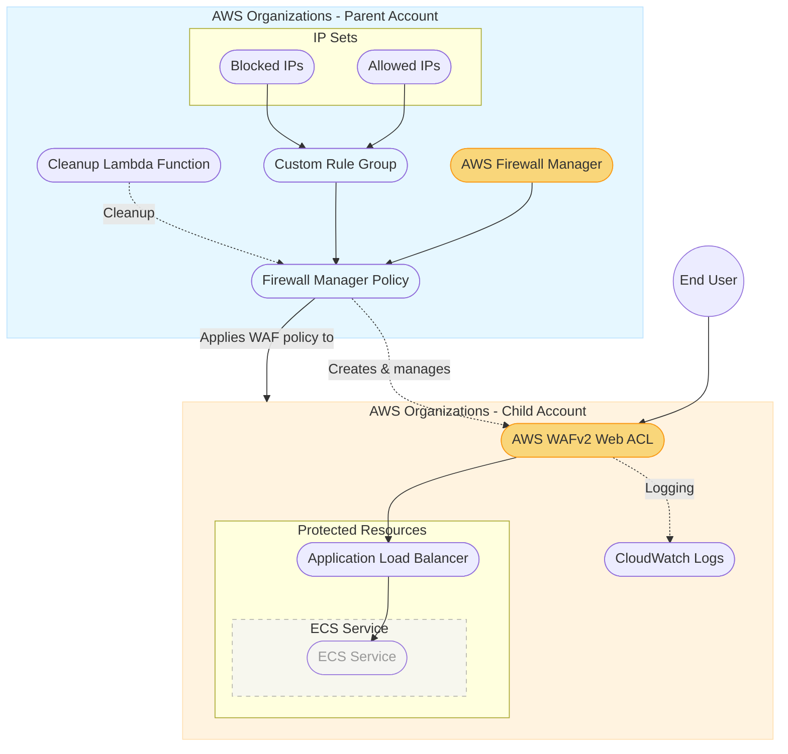

# Firewall Manager Implementation Diagram

## Key Components:

### Parent Account (Firewall Manager Administrator)
1. **AWS Firewall Manager**: Central service for managing WAF rules across accounts
2. **Custom Rule Group**: Contains custom WAF rules:
   - Allowed IPs Set (whitelist)
   - Blocked IPs Set (blacklist)
   - SQL Injection Protection
3. **Firewall Manager Policy**: Policy that applies WAF protection to resources in specified accounts
4. **Cleanup Lambda Function**: Handles proper resource cleanup during stack deletion

### Child Account (Application Account)
1. **AWS WAFv2 Web ACL**: Created and managed by Firewall Manager
   - Includes both custom rules from parent account
   - Includes AWS managed rule groups:
     - Amazon IP Reputation List
     - Bot Control Rule Set
     - Common Rule Set
2. **Protected Resources**:
   - **Application Load Balancer**: Distributes traffic to backend services
   - **ECS Service**: Container-based application (de-emphasized as not the focus)
3. **CloudWatch Logs**: Captures and stores WAF logs for analysis and auditing

### Benefits of this Architecture
- Centralized security policy management
- Consistent WAF protection across multiple accounts
- Automated deployment of security controls to new resources
- Organization-wide security compliance enforcement
