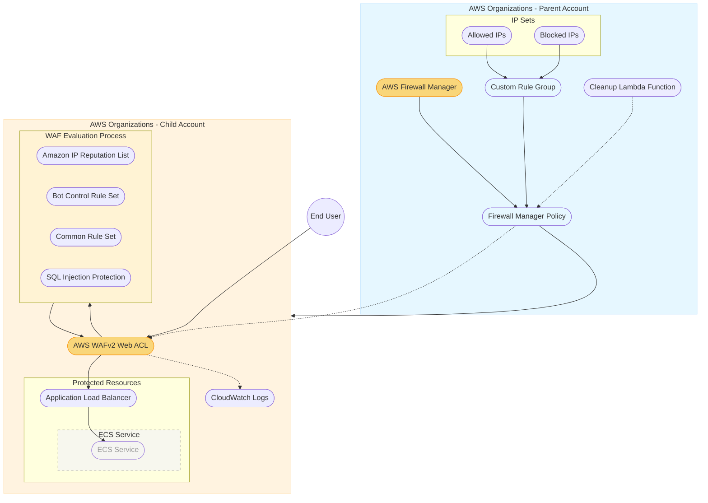

# Firewall Manager Implementation Diagram

## Key Components:

### User Traffic Flow
1. **Step 1**: End user sends web request to the application 
2. **Step 2**: WAF evaluates the request against all protection rules
3. **Step 3**: Rules return allow or block verdict
4. **Step 4**: If allowed, request passes to the ALB
5. **Step 5**: ALB forwards the request to the appropriate ECS service

### Parent Account (Firewall Manager Administrator)
- **AWS Firewall Manager**: Central service for managing WAF rules across accounts
- **Custom Rule Group**: Contains custom WAF rules:
  - Allowed IPs Set (whitelist)
  - Blocked IPs Set (blacklist)
  - SQL Injection Protection rules
- **Firewall Manager Policy**: Policy that applies WAF protection to resources in specified accounts
- **Cleanup Lambda Function**: Handles proper resource cleanup during stack deletion

### Child Account (Application Account)
- **AWS WAFv2 Web ACL**: Created and managed by Firewall Manager
- **WAF Evaluation Process**:
  - Amazon IP Reputation List: Blocks requests from known malicious IP addresses
  - Bot Control Rule Set: Identifies and manages requests from bots
  - Common Rule Set: Protects against common vulnerabilities
  - SQL Injection Protection: Blocks malicious SQL code in requests
- **Protected Resources**:
  - Application Load Balancer: Distributes traffic to backend services
  - ECS Service: Container-based application (de-emphasized as not the focus)
- **CloudWatch Logs**: Captures and stores WAF logs for analysis and auditing

### Management Flow (Letters A-D)
- **A**: Firewall Manager configures security policies
- **B**: Custom rules are applied to the Firewall Manager policy
- **C**: The policy is applied to the child account
- **D**: Firewall Manager creates and manages the WAF in the child account

### Benefits of this Architecture
- Centralized security policy management
- Consistent WAF protection across multiple accounts
- Automated deployment of security controls to new resources
- Organization-wide security compliance enforcement
