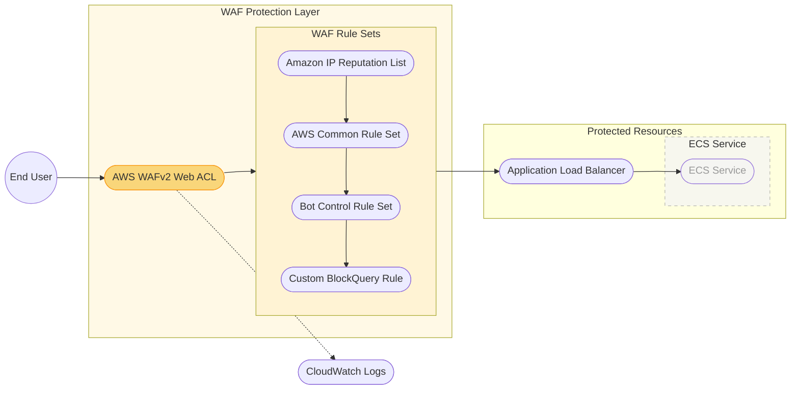

# Standalone WAF Implementation Diagram

## Key Components:

1. **Traffic Flow**
   - **Step 1**: End user sends web request to the application
   - **Step 2-5**: AWS WAF evaluates the request against each rule set
   - **Step 6**: If allowed by all rules, request passes to the ALB
   - **Step 7**: ALB forwards the request to the appropriate ECS service

2. **WAF Protection Layer**
   - **AWS WAFv2 Web ACL**: Central component that processes and filters web requests
   - **Rule Sets**:
     - **Amazon IP Reputation List**: Blocks requests from known malicious IP addresses
     - **AWS Common Rule Set**: Protects against common vulnerabilities (excl. SizeRestrictions_BODY)
     - **Bot Control Rule Set**: Identifies and manages requests from bots
     - **Custom BlockQuery Rule**: Custom rule that blocks requests containing "blockme" string

3. **Protected Resources**
   - **Application Load Balancer**: Distributes traffic to the backend ECS services
   - **ECS Service**: Container-based application (de-emphasized as not the focus)

4. **Monitoring**
   - **CloudWatch Logs**: Captures and stores WAF logs for analysis and auditing
